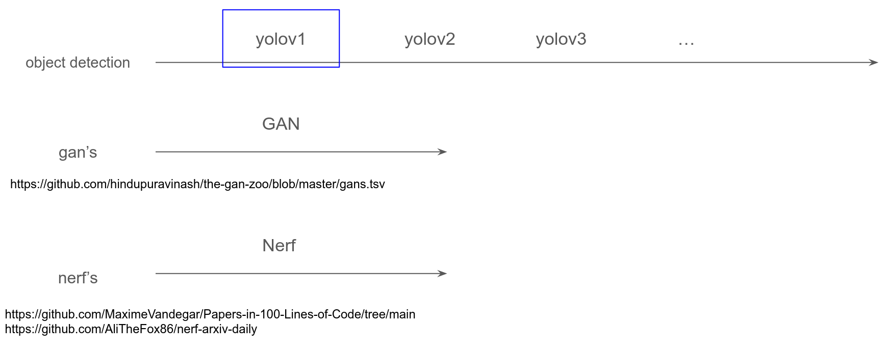

# deep-learning


- [x] Implement the loss function of Yolov1 (see `detection/yolov1/loss_function.ipynb`)
- [ ] Add classification loss and train Yolov1


# what's happening



### Steps:
```bash
git add detection
git commit -m 'some-message'
git push -u origin main
```


