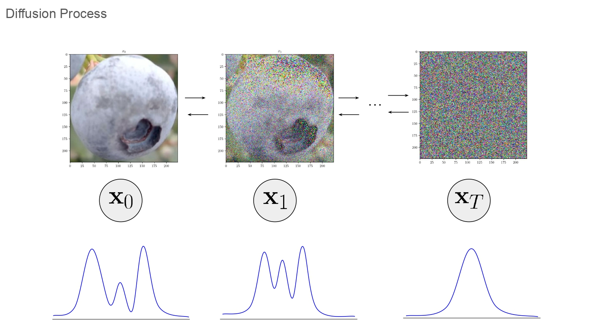
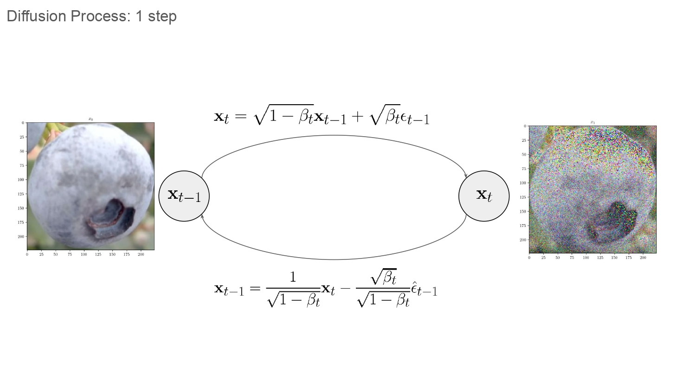
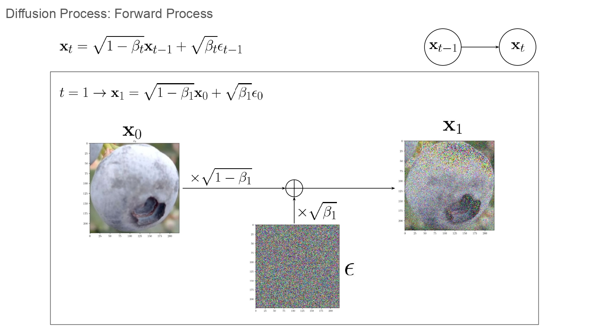

# **Modelos de difusión**

Los procesos de difusión son el origen de redes neuronales como DALL-E y Stable Diffusion. Su principal aplicación es la generación de imágenes. En este blog se van a explicar de forma sencilla en qué consiste el proceso de difusión, cuales son las dos etapas de dicho proceso, qué architectura fue la primera en usarse para poder generar imagenes, cómo se entrena una red neuronal en el marco del proceso de difusión y cómo generar imagenes con dicha red neuronal.

## Proceso de Difussión

La Figura 1 muestra el proceso de difusión aplicado a la imagen de un arándano, la imagen original es indicada mediante la variable $\bold{x}_0$. Sobre esta imagen se aplica cierta cantidad de ruido $\epsilon$ para obtener $\bold{x}_1$, luego de realizar esta operación $T$ veces se obtiene $\bold{x}_T$ la cual es una imagen que en escencia contiene exclusivamente ruido.

El ruido que es agregado es muestreado de una distribución normal, es decir $ \epsilon \sim \mathcal{N}(0,\bold{I})$. Al aplicar este ruido constantemente sobre $\bold{x}_0$ tiene como resultado una imagen $\bold{x}_T$ que es indistingible de ruido generado por una distribución del tipo $\mathcal{N}(0,\bold{I})$.

El proceso inverso a agregar ruido, es el de extraerlo de $\bold{x}_T$, de tal forma que luego de realizar esta operación de forma iterativa, se obtenga nuevamente $\bold{x}_0$. Una vez que un modelo de IA aprende a extraer ruido de imagenes, este puede ser usado a generar imagenes.

Para generar imagenes se parte de una imagen muestreada de una distribución del tipo $\mathcal{N}(0,\bold{I})$. Luego modelos entrenados con la metodología indicada (ej. *DALL-E* o *Stable Diffusion*) extraen ruido de forma iterativa, de tal forma que luego de un número de pasos el resultado es una imagen que tiene cierta coherencia. 

<figure>
    
    <figcaption>Figura 1. Proceso de difusión aplicado a la imagen de un arándano</figcaption>
</figure>

La Figura 2 muestra las ecuaciones necesarias para pasar de un determinado estado $\bold{x}_{t-1}$ hacia $\bold{x}_t$ y viceversa. En esta se muestra una imagen de un arándano en dos estados, las ecuaciones que se emplean para determinar la cantidad de ruido que se aplica. El proceso que se sigue para ir de $\bold{x}_{t-1} \rightarrow \bold{x}_t$ es llamado "Forward Process" y el proceso que se sigue para ir de $\bold{x}_{t} \rightarrow \bold{x}_{t-1}$ es llamado "Backward process", en las siguientes secciones se explica cómo funcionan ambos procesos.

<figure>
    
    <figcaption>Figura 2. Proceso de difusión aplicado a la imagen de un arándano</figcaption>
</figure>

## Forward Process

La Figura 3 muestra el "Forward Process", este proceso consiste en pasar de $\bold{x}_{t-1}$ hacia $\bold{x}_{t}$. Para lograr esto se emplea la ecuación (1). 

$$
\begin{equation}
\bold{x}_t = \sqrt{1 - \beta_{t}} \bold{x}_{t-1} + \sqrt{\beta_t} \epsilon_{t-1}
\end{equation}
$$

La ecuación $(1)$ determina la forma en la que el ruido $\epsilon$ afecta la información original $\bold{x}_0$, dicha información son imagenes. La imagen $\bold{x}_0$ y el ruido $\epsilon$ son ponderados por $\sqrt{1-\beta_{t}}$ y $\sqrt{\beta_t}$ respectivamente y sumados. Conforme $\beta_t$ aumente su valor cerca a 1 se tendrá que el ruido afectará en mayor medida a la imágen. Los valores de $\beta$ no son muy grandes, es decir la cantidad de ruido que se agrega en cada paso es muy pequeña, por lo que para tener un cambio notable en $\bold{x}_0$ se emplean multiples pasos. La imagen muestra graficamente el proceso que sigue la ecuación $(1)$ para $t=1$.

<figure>
    
    <figcaption>Figura 3. Forward process</figcaption>
</figure>

